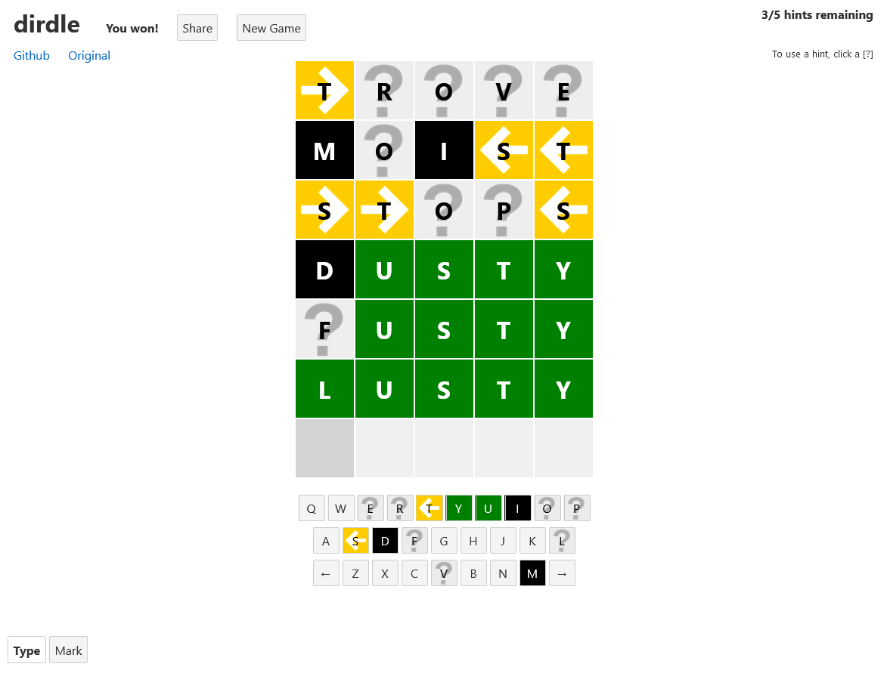
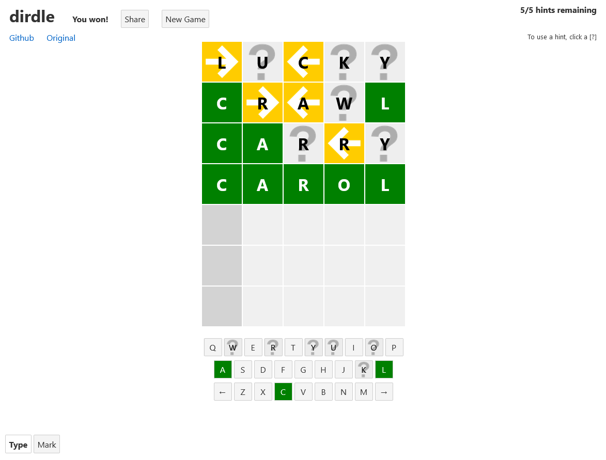

# dirdle

Directional wordle. Tells you which direction a letter is located, but does not tell if a letter either is in the right place or is not even in the word.





Click a [?] to reveal if the letter is in the right place or not in the word. You get up to 5 incorrect guesses

## Get started

Install the dependencies...

```bash
cd svelte-app
npm install
```

...then start webpack:

```bash
npm run dev
```

Navigate to [localhost:8080](http://localhost:8080). You should see your app running. Edit a component file in `src`, save it, and the page should reload with your changes.